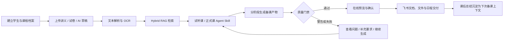
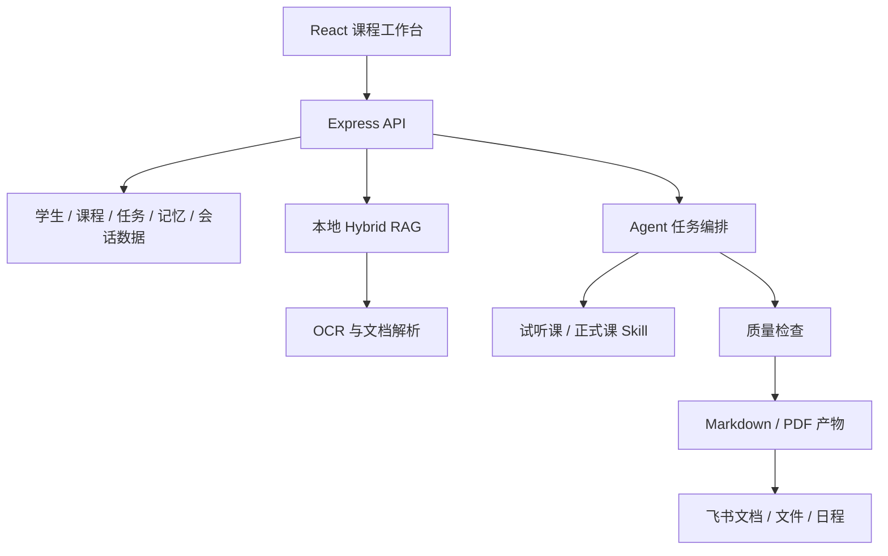

# 🎓 AI 智能备课工作台

> 面向一对一数学教师的 AI 备课工作台：把学生信息、资料检索、内容生成、质量校验与课后交付收敛到一条可追踪、可干预的工作流。


## 项目概览

| 维度 | 说明 |
| --- | --- |
| 目标用户 | 需要高频完成试听课、正式课备课与课后反馈的一对一数学教师 |
| 核心问题 | 教学资料分散、通用 AI 输出不稳定、多工具切换导致备课与交付链路割裂 |
| 产品方案 | 用课程工作台承载上下文，以 Hybrid RAG 提供资料依据，以 Agent Skill 固化备课方法，再通过质量门禁与人工补充完成交付 |
| MVP 边界 | 优先跑通单教师的端到端闭环，不在当前阶段扩展排课、收费、家校 CRM 等教务功能 |
| 我的职责 | 独立完成业务问题拆解、MVP 定义、交互设计、AI 工作流设计与全栈实现 |

## 为什么做

传统备课并不只是“让大模型生成一份教案”。真实流程中，教师需要先理解学生情况，从本地资料中找题和解析，再分别制作课件、逐字稿、知识点详解和课后反馈。任一环节失去上下文，都会让 AI 输出难以直接使用。

这个项目聚焦四个关键矛盾：

- **资料很多，但检索成本高**：试卷、讲义和历史材料分散在不同文件夹，重复查找和筛选占用备课时间。
- **能生成，不等于能上课**：试听课与正式课的目标、结构和交付物不同，单轮 Prompt 很难稳定复用。
- **长任务缺少控制感**：生成耗时较长时，教师需要知道任务进度、失败原因，并能重试或继续补充。
- **产物生成后仍要手工搬运**：本地文件、预览、日程和飞书资料如果彼此割裂，自动化只完成了半条链路。

## 产品闭环



## MVP 功能地图

### 0. 教师驾驶舱：先看今天，再处理异常

- 首页聚合今日待办、即将上课、运行中任务、待确认课后总结与资料索引状态。
- 对失败任务、缺失产物和待确认事项给出可执行的下一步，不再依赖教师逐页巡检。
- 提供近 7 天课程量、完成率、补充生成率、质量均分与高频薄弱点，帮助教师复盘工作流。

### 1. 课程上下文：先理解“给谁上、上什么”

- 以学生为主线管理学段、年级、薄弱点、常见错误和家长关注点。
- 区分试听课与正式课，使用不同的输入字段、内容结构和交付标准。
- 记录课后掌握情况、未解决问题与下节课建议，形成连续学习档案。

### 2. 资料增强：让生成有依据，而不是凭空发挥

- 支持单文件与文件夹上传，保留原有目录结构。
- 对 Markdown、文本、Office 文档和 PDF 建立本地资料索引；扫描型 PDF 可先经过 OCR。
- 组合向量语义检索与关键词检索，并支持重点资料加权。
- 将命中的题目、解析和资料片段写入生成上下文，同时保留来源与命中原因，方便教师核对。

### 3. Agent 工作流：把备课方法固化成可复用流程

- 将试听课与正式课方法分别封装为 `trial-lesson-prep`、`formal-lesson-prep` Skill，而不是依赖一次性长 Prompt。
- 正式备课采用阶段化生成：先处理 OCR 与题目提取，再并行生成课堂材料和教师材料。
- 根据课程类型输出课堂课件、教师逐字稿、知识点详解、课后反馈；正式课额外生成教师授课一体版、作业与答案。
- 支持在已有结果上补充要求并继续生成，避免一次失败后从头开始。

### 4. 可控生成：把 AI 黑盒变成可运营任务

- 显示排队、运行、完成、失败和取消等任务状态。
- 保存运行日志与中间文件，提供超时 watchdog 和失败重试。
- 允许教师上传补充材料、调整要求，并针对已有结果继续迭代。
- 提供系统诊断和数据备份，降低单人使用时的维护成本。

### 5. 结果交付：从“文件生成”走到“可以使用”

- 在网页中直接预览 Markdown、PDF 与图片产物。
- 任务完成后，可同步为飞书文档与云空间文件，并关联课程日程。
- 课后总结回写学生档案，为下一次备课提供连续上下文。

### 6. 可复用模板：把成熟备课要求沉淀下来

- 可将常用课型、学段、课长和执行要求保存为模板，并在新建课程时一键套用。
- 模板只保存课程配置与提示词，不包含学生姓名、成绩或家长沟通等隐私信息。
- 支持继续编辑已套用的字段，兼顾标准化与单次课程差异。

### 7. 记忆管理：把长期上下文变成可运营资产

- 新增独立的记忆条目库：学生画像、教师偏好、教学洞察、备课要求与备注均可沉淀为结构化记忆。
- 每条记忆支持分类、标签、固定、启用/停用、搜索与服务端持久化；不再把长期上下文困在一段难维护的文本里。
- AI 备课草稿与正式备课 Prompt 会自动携带“启用的记忆条目”，并明确标注这是可人工编辑的长期记忆，避免模型凭空编造学生事实。
- 课后确认的总结仍会回写学生长期档案与路线图，形成“课上生成 → 课后沉淀 → 下次备课召回”的记忆闭环。

### 8. 多轮状态控制：把一次性生成升级为可恢复会话

- 以学生为单位维护服务端多轮会话：每轮保留用户指令、AI 回复、当前步骤与关键状态（草稿日志、课程、任务、质量状态）。
- AI 草稿生成与“继续生成”会自动记录会话轮次；教师可手动新建、重置、完成或追加用户指令/AI 回复。
- 会话状态脱离浏览器 localStorage，换设备或刷新后仍可恢复，避免草稿与上下文丢失。
- 与既有课程任务状态机衔接：课程创建、任务运行、失败继续、质量重跑、课后沉淀均有可解释的步骤，支持“看得见、能干预、可恢复”。

## 与 AIPM 岗位能力对应

| AIPM 能力 | 本项目实现 |
| --- | --- |
| 拆解 AI 长任务，定义可执行的状态机 | 课程任务从排队/运行/失败/继续到课后确认的状态机；多轮会话步骤 `user_request → draft_generated → course_created → lesson_running → post_class/completed` |
| 设计 LLM 记忆与上下文管理 | 学生长期档案 + 可增删改查/停用/固定的记忆条目；自动写入 Prompt 并保留人工控制权 |
| 让 AI 生成可干预、可恢复 | 失败日志、继续生成、质量门禁自动补救、多轮会话持久化，换设备可恢复 |
| 平衡 AI 自动化与用户信任 | 记忆来源可追溯（手动/AI 草稿/课后沉淀/备课任务），可一键停用；不把模型推断当作学生事实 |
| 用数据反哺产品优化 | 保留多轮状态、质量分数、补充生成率、薄弱点统计；Roadmap 中继续用于评测与反馈分析 |

## 关键产品决策

| 决策 | 为什么这样做 | 当前实现 |
| --- | --- | --- |
| 用 Skill 固化流程，而不是只写 Prompt | 备课包含稳定的方法、文件规范和检查步骤，需要版本化与复用 | 试听课、正式课两套内置 Skill |
| 先做单教师闭环 | 核心风险是生成结果能否进入真实工作流，多角色协作不是 MVP 首要假设 | 本地优先、管理员账号、学生—课程工作台 |
| 检索结果必须可核对 | RAG 的价值不仅是“找到了”，还要让教师知道内容来自哪里、为何命中 | 资料索引、来源片段、命中原因与资料预览 |
| 长任务必须可恢复 | AI 生成存在超时、失败和追加要求，产品需要提供明确状态与恢复路径 | 任务状态、日志、watchdog、自动重试与继续生成 |
| 质量检查只覆盖可判定项 | 文件齐全不代表教学内容正确，不能把格式分数包装成内容准确率 | 校验核心产物、文件有效性、反馈模板与中间过程文件 |

## 质量与评测设计

当前版本先把“可自动判定”的交付底线做成质量门禁：

- **产物完整性**：检查不同课程类型要求的核心文件是否齐全、文件是否有效。
- **格式可用性**：检查课后反馈是否仍含待填写占位符，是否符合固定交付模板。
- **过程可追踪性**：检查题目提取、答案核对、课件计划等关键中间文件是否存在。
- **失败可恢复性**：保留任务状态、日志与失败信息，支持重试和基于现有结果继续生成。

下一阶段计划用真实备课样本建立评测集，重点跟踪：

| 指标 | 目的 | 计划方法 |
| --- | --- | --- |
| 检索相关性 | 判断召回资料是否真正支持本节课 | 对 Top-K 结果做人工相关性标注 |
| 内容正确性 | 避免答案、推导和知识点错误 | 教师抽检 + 错误类型归因 |
| 首次可用率 | 衡量生成结果是否无需大改即可授课 | 记录首次通过、补充生成与人工重写比例 |
| 交付耗时 | 判断工作流是否减少跨工具操作 | 记录从创建课程到确认交付的时长 |
| 教师修改率 | 找出最需要优化的产物与环节 | 对比生成稿与最终确认稿差异 |

> 当前仓库未对外宣称提效比例或内容准确率；在形成足量真实样本前，先保证评测口径可解释、结果可复查。

## 系统结构



技术栈：React 19、TypeScript、Vite、Node.js、Express、SQLite FTS、可选向量 Embedding、Codex CLI、PaddleOCR、lark-cli。

## 快速开始

环境要求：Node.js 22+，以及已完成登录的 Codex CLI。

```bash
git clone https://github.com/KunyangZhang/lesson-prep-web.git
cd lesson-prep-web
cp .env.example .env
npm install
npm run dev
```

打开 `http://localhost:4178`，首次进入时初始化管理员账号。

项目内置两个备课 Skill，随仓库直接使用：

- `skills/trial-lesson-prep`
- `skills/formal-lesson-prep`

## 配置说明

常用配置集中在 `.env`，完整示例见 [`.env.example`](./.env.example) 和 [`deploy/env.production.example`](./deploy/env.production.example)。

| 配置组 | 关键变量 | 用途 |
| --- | --- | --- |
| 工作区 | `PREP_WORKSPACE`、`PREP_MATERIAL_ROOT`、`APP_DATA_DIR` | 备课产物、资料库与应用数据目录 |
| Agent | `CODEX_COMMAND`、`CODEX_MODEL`、`CODEX_AUTO_RUN` | 模型调用与自动运行策略 |
| 任务控制 | `CODEX_STAGED_LESSON_PREP`、`CODEX_IDLE_TIMEOUT_MS`、`CODEX_IDLE_MAX_RETRIES` | 阶段化执行、超时与重试 |
| RAG | `RAG_EMBEDDING_PROVIDER`、`RAG_VECTOR_WEIGHT`、`RAG_KEYWORD_WEIGHT` | Hybrid RAG 与召回权重 |
| OCR | `PREP_OCR_ENABLED`、`PADDLE_OCR_API_URL`、`PADDLE_OCR_API_TOKEN` | 扫描材料与 AI 草稿解析 |
| 飞书 | `FEISHU_SYNC_ENABLED`、`FEISHU_LESSON_PARENT_FOLDER_TOKEN` | 文档、文件、日程与消息同步 |
| 安全 | `SECURE_COOKIES`、`ENABLE_HSTS`、`TRUST_PROXY` | HTTPS 与反向代理配置 |

不要把 API Token、私钥或真实 `.env` 提交到代码仓库。

## 验证与部署

```bash
npm run check
npm test
npm run build
npm run deploy:check
```

需要验证完整链路时可运行隔离冒烟测试。它使用临时工作区和 fake Codex，不写入真实备课数据：

```bash
npm run smoke
```

Linux 部署示例：

```bash
cp deploy/env.production.example .env
npm ci
npm run build
bash scripts/server-setup.sh
npm start
```

生产环境建议使用仓库中的 systemd 与 Nginx 示例，并通过 `GET /api/health` 做健康检查：

- `deploy/systemd/lesson-prep-web.service.example`
- `deploy/nginx/lesson-prep-web.conf.example`

## 数据、隐私与备份

- 学生、课程、任务与资料索引默认保存在自有环境，不依赖第三方 SaaS 数据库。
- 账号设置支持下载应用数据备份，并提供工作区、资料库、Agent 配置与失败任务诊断。
- 完整恢复需要同时备份 `PREP_WORKSPACE` 与 `APP_DATA_DIR`。
- 公网部署时应启用 HTTPS、强密码和访问限制；飞书同步与外部 OCR/Embedding 服务应按实际数据合规要求启用。

## Roadmap

- 建立真实备课样本评测集，补齐检索相关性、内容正确性和首次可用率指标。
- 将教师的修改与重试行为沉淀为可分析的反馈数据，定位高频失败环节。
- 增加来源引用与答案核对的可视化，提升内容审阅效率。
- 在单教师闭环稳定后，再评估多人协作、权限与课程模板市场等扩展方向。

## 项目阶段

当前为可运行 MVP，重点验证的是：**Agent/RAG 能否被组织成教师可理解、可干预、可交付的完整产品流程。**

如果你关注的是 AI 产品设计，可以从“关键产品决策”和“质量与评测设计”开始阅读；如果你希望运行项目，可直接参考“快速开始”。
